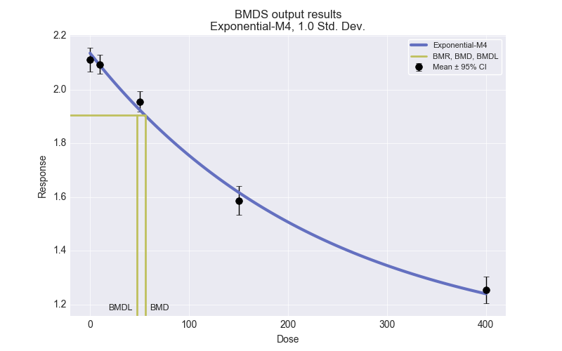

API
===

The section documents some of the key objects and methods used in the
BMDS module.

BMDS session
------------

.. automodule:: bmds.session
    :members:
    :undoc-members:

Datasets
--------

.. automodule:: bmds.datasets
    :members:
    :undoc-members:

BMD models
----------

.. autoclass:: bmds.models.BMDModel
    :members:
    :undoc-members:

   BMD models can generate plots using the ``plot()`` method; an example
   is shown here.

Batch runs using SessionBatch
-----------------------------

.. automodule:: bmds.batch
    :members:
    :undoc-members:
