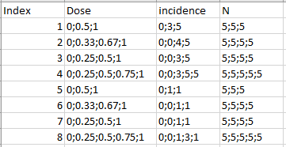

# Batch Execution

If you have several dose-response datasets that you want to run in PyBMDS, you can run a batch execution by importing a file with the datasets. For dichotomous datasets, your input file may look like this:



where you have 8 dichotomous datasets.

You can import the file and create `DichotomousDataset()` objects for each by:

```python
import bmds
from bmds import DichotomousDataset
from bmds import ContinuousDataset
from bmds.bmds3.models import dichotomous, continuous
from bmds.bmds3.constants import DistType, PriorClass, PriorType
from bmds.bmds3.models.continuous import ContinuousModel
from bmds.bmds3.types.continuous import ContinuousRiskType
from bmds.bmds3.types.dichotomous import DichotomousRiskType
from bmds.bmds3.types.continuous import ContinuousAnalysis, ContinuousModelSettings, ContinuousResult
from bmds.bmds3.types.priors import ModelPriors, Prior
from itertools import cycle
from bmds import plotting

import pandas as pd

# change output file to where you want it to belong
OUTPUT_FN = 'OUTPUT FILE LOCATION'

# change input file to where you want it to belong
fn = 'INPUT FILE LOCATION'
assert os.path.exists(fn)

df = pd.read_excel(fn)
df.head()

def dichotomous_dictify(d):
    try:
        return dict(
              id=d.Index,
              doses=list(map(float, d.Dose.split(';'))),
              ns=list(map(int, d['N'].split(';'))),
              incidences=list(map(int, d['incidence'].split(';'))),
        )
    except:
        print('Row {} not included'.format(d.Index))
        return None
   
dichotomous_datasets = [
    d for d in df.apply(dichotomous_dictify, axis=1) 
    if d is not None
]

def get_bmds_dataset(dtype, dataset):
    if dtype == bmds.constants.CONTINUOUS:
        cls = bmds.ContinuousDataset
    elif dtype in bmds.constants.DICHOTOMOUS_DTYPES:
        cls = bmds.DichotomousDataset
    return cls(**dataset)
```

You can now run your datasets on one model or fit the datasets to all of the dichotomous models and select the best fit.

```python
def execute_all_datasets(dtype, original_dataset):
    dataset = deepcopy(original_dataset)
    bmds_dataset = get_bmds_dataset(dtype, dataset)
    session = dichotomous.Multistage(dataset=bmds_dataset, settings={"degree": 2})
    result = session.execute()
    #print(session.text()) ## untoggle print(session.text()) if you want to see the results of each dataset
    return result

dichotomous_results = [
    execute_all_datasets(bmds.constants.DICHOTOMOUS, dataset) 
    for dataset in dichotomous_datasets
]
```

You can then append the results and save them.

```python
out = []

for session in dichotomous_results:
    out.append([session.bmd,session.bmdl,session.bmdu,session.parameters.values])

print(out)

fn = os.path.expanduser(OUTPUT_FN)

output_df = pd.DataFrame(out)
output_df.to_excel(fn, index=True)


```python
import bmds
from bmds.bmds3.batch import BmdsSessionBatch, ExecutionResponse
from bmds.bmds3.sessions import Bmds330
from bmds.datasets import DichotomousDataset

# create multiple datasets
datasets = [
    DichotomousDataset(doses=[0, 10, 20, 30], ns=[10, 10, 10, 10], incidences=[0, 1, 2, 3]),
    DichotomousDataset(doses=[0, 10, 20, 30], ns=[10, 10, 10, 10], incidences=[0, 4, 5, 6])
]

# create a function that takes a dataset as input and returns a session response as output
def runner(ds):
    sess = Bmds330(dataset=ds)
    sess.add_model(bmds.constants.M_Logistic, settings={"bmr": 0.2})
    sess.execute_and_recommend()
    return ExecutionResponse(success=True, content=[sess.to_dict()])

# execute all datasets and sessions on a single processor
batch = BmdsSessionBatch().execute(datasets, runner, nprocs=1)

# save Excel and Word reports
batch.to_excel("report.xlsx")
batch.to_docx().save("report.docx")
```
