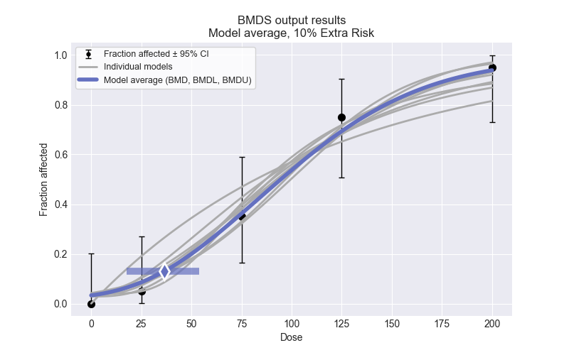

# Run Bayesian Model Averaging for a Dichotomous Dataset

Bayesian model averaging is currently only available for dichotomous datasets in BMDS. Here, we will go over how to run a dichotomous analysis with Bayesian model averaging and how to plot your results. Also, we will demonstrate how you can override the default priors for parameter estimation. 

## Quickstart

To run Bayesian model averaging:

```python
import bmds
from bmds import DichotomousDataset
from bmds.bmds3.models import dichotomous
from bmds.bmds3.types.dichotomous import DichotomousRiskType

# create a dichotomous dataset
dataset = DichotomousDataset(
    doses=[0, 25, 75, 125, 200],
    ns=[20, 20, 20, 20, 20],
    incidences=[0, 1, 7, 15, 19],
)

session1 = bmds.BMDS.latest_version(dataset=dataset)
session1.add_default_bayesian_models()
session1.execute()

res = session1.model_average.results
print(f"BMD = {res.bmd:.2f} [{res.bmdl:.2f}, {res.bmdu:.2f}]")

bma_plot = session1.model_average.plot()
bma_plot.savefig("bma.png")
```

Here, you will get an output of the BMD [BMDL, BMDU], as:

```python
BMD = 36.65 [17.81, 53.97]
```

and a plot that will show the model average fit:


## Changing the input settings

The default settings for a dichotomous Bayesian model averaged run use a BMR of 10% Extra Risk and a 95% confidence interval. You can change these settings by:

```python
session1.add_default_bayesian_models(global_settings = {"bmr": 0.05, "bmr_type": DichotomousRiskType.AddedRisk, "alpha": 0.1})
```

This would run the dichotomous models for a BMR of 5% Added Risk at a 90% confidence interval.

## Running one Bayesian model

You can also run one model with the default prior distributions for the parameters, rather than running all of the models and finding the model average. If you wanted to run the Logistic model with the default prior distributions, you would:

```python
model = dichotomous.Logistic(dataset=dataset, settings={"priors": PriorClass.bayesian})
result = model.execute()
print(model.text())
```

When the results are printed, you can see the default distributions for `a ~ Normal(0, 2)` and `b ~ Lognormal(0, 2)` and their constraints. The results will show:

```python
      Logistic      
════════════════════

Input Summary:
╒═══════════════════╤════════════════╕
│ BMR               │ 10% Extra Risk │
│ Confidence Level  │ 0.95           │
│ Modeling approach │ Bayesian       │
│ Samples           │ 100            │
│ Burn-in           │ 20             │
╘═══════════════════╧════════════════╛

Parameter Settings:
╒═════════════╤════════════════╤═══════════╤═════════╤═══════╤═══════╕
│ Parameter   │ Distribution   │   Initial │   Stdev │   Min │   Max │
╞═════════════╪════════════════╪═══════════╪═════════╪═══════╪═══════╡
│ a           │ Normal         │         0 │       2 │   -20 │    20 │
│ b           │ Lognormal      │         0 │       2 │     0 │    40 │
╘═════════════╧════════════════╧═══════════╧═════════╧═══════╧═══════╛

Summary:
╒════════════════╤═══════════╕
│ BMD            │ 40.0459   │
│ BMDL           │ 29.5605   │
│ BMDU           │ 52.8955   │
│ AIC            │ 84.2304   │
│ Log Likelihood │ 40.1152   │
│ P-Value        │  0.678322 │
│ Overall DOF    │  3.08389  │
│ Chi²           │  1.58231  │
╘════════════════╧═══════════╛

Model Parameters:
╒════════════╤════════════╤═══════════╤═════════════╤════════════╤════════════╕
│ Variable   │   Estimate │ Bounded   │   Std Error │   Lower CI │   Upper CI │
╞════════════╪════════════╪═══════════╪═════════════╪════════════╪════════════╡
│ a          │ -3.12092   │ no        │  0.586645   │ -4.27072   │ -1.97112   │
│ b          │  0.0321918 │ no        │  0.00594456 │  0.0205406 │  0.0438429 │
╘════════════╧════════════╧═══════════╧═════════════╧════════════╧════════════╛

Goodness of Fit:
╒════════╤════════╤════════════╤════════════╤════════════╤═══════════════════╕
│   Dose │   Size │   Observed │   Expected │   Est Prob │   Scaled Residual │
╞════════╪════════╪════════════╪════════════╪════════════╪═══════════════════╡
│      0 │     20 │          0 │    0.84505 │  0.0422525 │         -0.939325 │
│     25 │     20 │          1 │    1.79592 │  0.0897962 │         -0.622527 │
│     75 │     20 │          7 │    6.60729 │  0.330364  │          0.186699 │
│    125 │     20 │         15 │   14.2315  │  0.711576  │          0.379305 │
│    200 │     20 │         19 │   19.3004  │  0.965022  │         -0.365663 │
╘════════╧════════╧════════════╧════════════╧════════════╧═══════════════════╛

Analysis of Deviance:
╒═══════════════╤══════════════════╤════════════╤════════════╤════════════╤═════════════╕
│ Model         │   Log Likelihood │   # Params │ Deviance   │ Test DOF   │ P-Value     │
╞═══════════════╪══════════════════╪════════════╪════════════╪════════════╪═════════════╡
│ Full model    │         -32.1362 │          5 │ -          │ -          │ -           │
│ Fitted model  │         -40.1152 │          2 │ 15.9579    │ 3          │ 0.00115676  │
│ Reduced model │         -68.0292 │          1 │ 71.7859    │ 4          │ 9.54792e-15 │
╘═══════════════╧══════════════════╧════════════╧════════════╧════════════╧═════════════╛
```

The default samples and burn-in are 100 and 20, respectively. You can change the burn-ins and samples by:

```python
model = dichotomous.Logistic(dataset=dataset, settings={"priors": PriorClass.bayesian, "samples": 1000, "burnin": 500})
```

The maximum number of samples allowed in BMDS is 1000. 

## Changing parameter settings

When running just one Bayesian model, you can change the input parameter settings by:

```python
model = dichotomous.Logistic(dataset=dataset, settings={"priors": PriorClass.bayesian, "samples": 1000, "burnin": 500})


a = model.settings.priors.get_prior('a')
a.stdev = 1
a.min_value = -15
a.max_value = 15
b = model.settings.priors.get_prior('b')
b.stdev = 3
result = model.execute()
print(model.text())
```

Users can also change the parameter prior types from the default listed in the BMDS User Guide. In PyBMDS, parameters can be given a Normal, Log-Normal, or Uniform distribution. These can be changed by:

```python
model = dichotomous.Weibull(dataset=bmds_dataset, settings={"priors": PriorClass.bayesian, "samples": 1000, "burnin": 500})
g = session.settings.priors.get_prior('g')
g.type = PriorType.Uniform
g.min_value=0
g.max_value=1
```

Or:
```python
g = session.settings.priors.get_prior('g')
g.type = PriorType.Lognormal
g.min_value=0
g.max_value=1
g.initial_value=0
g.stdev=1.5
```

## Model average on a subset of models

You can select a set of models to model average on, rather than using all of the default dichotomous models. For example, to model average on the Logistic, Probit, and Weibull models, you can:

```python
session1 = bmds.BMDS.latest_version(dataset=dataset)
session1.add_model(bmds.constants.M_Weibull, {"priors": PriorClass.bayesian})
session1.add_model(bmds.constants.M_Logistic, {"priors": PriorClass.bayesian})
session1.add_model(bmds.constants.M_Probit, {"priors": PriorClass.bayesian})
session1.add_model_averaging()

session1.execute()

res = session1.model_average.results
print(f"BMD = {res.bmd:.2f} [{res.bmdl:.2f}, {res.bmdu:.2f}]")

bma_plot = session1.model_average.plot()
bma_plot.savefig("bma-subset.png")
```

## Select best fit model

Rather than model averaging, you can also run all models or a subset of models and select the model that best fits the data. When selecting the best fit model against all of the default models, you would:

```python
session1.add_default_bayesian_models()

session1.execute()
session1.recommend()

model_index = session1.recommender.results.recommended_model_index
if model_index:
    model = session1.models[model_index]
    print(model.text())
    mplot = model.plot()
    mplot.savefig("recommended-model-plot-bayesian.png")
```

When selecting the best fit model against a subset of models, you would:

```python
session1.add_model(bmds.constants.M_Weibull, {"priors": PriorClass.bayesian})
session1.add_model(bmds.constants.M_Logistic, {"priors": PriorClass.bayesian})
session1.add_model(bmds.constants.M_Probit, {"priors": PriorClass.bayesian})

session1.execute()
session1.recommend()

model_index = session1.recommender.results.recommended_model_index
if model_index:
    model = session1.models[model_index]
    print(model.text())
    mplot = model.plot()
    mplot.savefig("recommended-model-plot-bayesian.png")
```
