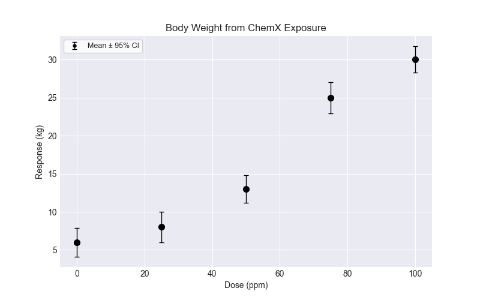
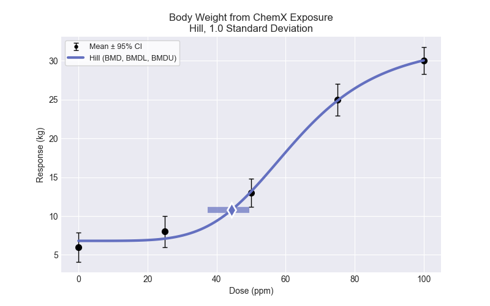
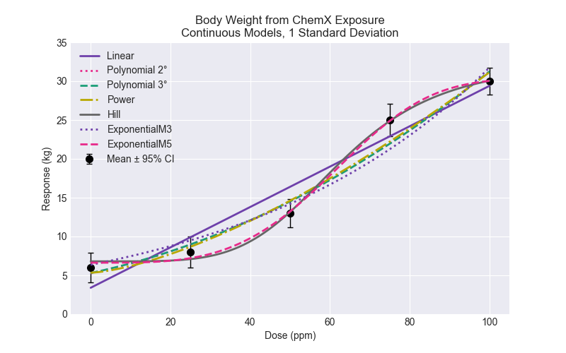

# Run a Continuous Dataset 

## Quickstart

To run a continuous dataset:

```python
import bmds
from bmds import ContinuousDataset
from bmds.bmds3.constants import DistType, PriorClass
from bmds.bmds3.types.continuous import ContinuousRiskType

# create a continuous dataset
dataset = ContinuousDataset(
    doses=[0, 25, 50, 75, 100],
    ns=[20, 20, 20, 20, 20],
    means=[6, 8, 13, 25, 30],
    stdevs=[4, 4.3, 3.8, 4.4, 3.7]
)

session = bmds.BMDS.latest_version(dataset=dataset)

session.add_default_models()

# execute the session
session.execute()

# recommend a best-fitting model
session.recommend()


model_index = session.recommender.results.recommended_model_index
if model_index:
    model = session.models[model_index]
    print(model.text())

# save excel report
df = session.to_df()
df.to_excel("report.xlsx")

# save to a word report
report = session.to_docx()
report.save("report.docx")
```

## Create a continuous dataset

To create a continuous dataset, you need a list of doses, mean responses, standard deviations, and the total number of subjects. As shown above, you use the ```ContinuousDataset()``` function and insert your data. You can also create a plot of the dataset:

```python
import bmds
from bmds import ContinuousDataset
from bmds.bmds3.models import continuous
from bmds.bmds3.types.continuous import ContinuousRiskType

dataset = ContinuousDataset(
    doses=[0, 25, 50, 75, 100],
    ns=[20, 20, 20, 20, 20],
    means=[6, 8, 13, 25, 30],
    stdevs=[4, 4.3, 3.8, 4.4, 3.7]
)

dplot = dataset.plot()
dplot.savefig("dataset-plot-cont.png")
```

The saved plot will look like this:


## Fitting one model to dataset

If you want to fit only one model to your dataset, you can fit the specific model to the dataset and print the results such as the BMD, BMDL, BMDU, p-value, AIC, etc. Say you want to fit the Hill model, you can run the code below and print the results:

```python
model = continuous.Hill(dataset)
model.execute()
text = model.text()
print(text)
```

Which will show:
```python
        Hill        
════════════════════

Input Summary:
╒════════════════════╤════════════════════════════╕
│ BMR                │ 1.0 Standard Deviation     │
│ Distribution       │ Normal + Constant variance │
│ Modeling Direction │ Up (↑)                     │
│ Confidence Level   │ 0.95                       │
│ Tail Probability   │ 0.01                       │
│ Modeling Approach  │ Frequentist restricted     │
╘════════════════════╧════════════════════════════╛

Parameter Settings:
╒═════════════╤═══════════╤═══════╤═══════╕
│ Parameter   │   Initial │   Min │   Max │
╞═════════════╪═══════════╪═══════╪═══════╡
│ g           │         0 │  -100 │   100 │
│ v           │         0 │  -100 │   100 │
│ k           │         0 │     0 │     5 │
│ n           │         1 │     1 │    18 │
│ alpha       │         0 │   -18 │    18 │
╘═════════════╧═══════════╧═══════╧═══════╛

Summary:
╒════════════════╤════════════╕
│ BMD            │  44.3603   │
│ BMDL           │  37.4379   │
│ BMDU           │  49.4299   │
│ AIC            │ 570.3      │
│ Log Likelihood │ 280.15     │
│ P-Value        │   0.163921 │
│ Model DOF      │   1        │
╘════════════════╧════════════╛

Model Parameters:
╒════════════╤════════════╤═══════════╤═════════════╤════════════╤════════════╕
│ Variable   │   Estimate │ Bounded   │   Std Error │   Lower CI │   Upper CI │
╞════════════╪════════════╪═══════════╪═════════════╪════════════╪════════════╡
│ g          │    6.80589 │ no        │    0.689269 │    5.45495 │    8.15683 │
│ v          │   25.6632  │ no        │    2.65373  │   20.462   │   30.8645  │
│ k          │   62.7872  │ no        │    3.59334  │   55.7444  │   69.83    │
│ n          │    4.87539 │ no        │    1.08357  │    2.75164 │    6.99915 │
│ alpha      │   15.881   │ no        │   35.6668   │  -54.0247  │   85.7866  │
╘════════════╧════════════╧═══════════╧═════════════╧════════════╧════════════╛

Goodness of Fit:
╒════════╤════════╤═════════════════╤═══════════════════╤══════════════════╤═══════════════════╕
│   Dose │   Size │   Observed Mean │   Calculated Mean │   Estimated Mean │   Scaled Residual │
╞════════╪════════╪═════════════════╪═══════════════════╪══════════════════╪═══════════════════╡
│      0 │     20 │               6 │                 6 │          6.80589 │        -0.904381  │
│     25 │     20 │               8 │                 8 │          7.09076 │         1.02037   │
│     50 │     20 │              13 │                13 │         13.1658  │        -0.186064  │
│     75 │     20 │              25 │                25 │         24.8734  │         0.14202   │
│    100 │     20 │              30 │                30 │         30.0641  │        -0.0719426 │
╘════════╧════════╧═════════════════╧═══════════════════╧══════════════════╧═══════════════════╛
╒════════╤════════╤═══════════════╤═════════════════╤════════════════╕
│   Dose │   Size │   Observed SD │   Calculated SD │   Estimated SD │
╞════════╪════════╪═══════════════╪═════════════════╪════════════════╡
│      0 │     20 │           4   │             4   │        3.98509 │
│     25 │     20 │           4.3 │             4.3 │        3.98509 │
│     50 │     20 │           3.8 │             3.8 │        3.98509 │
│     75 │     20 │           4.4 │             4.4 │        3.98509 │
│    100 │     20 │           3.7 │             3.7 │        3.98509 │
╘════════╧════════╧═══════════════╧═════════════════╧════════════════╛

Likelihoods of Interest:
╒═════════╤══════════════════╤════════════╤═════════╕
│ Model   │   Log Likelihood │   # Params │     AIC │
╞═════════╪══════════════════╪════════════╪═════════╡
│ A1      │         -279.181 │          6 │ 570.362 │
│ A2      │         -278.726 │         10 │ 577.452 │
│ A3      │         -279.181 │          6 │ 570.362 │
│ fitted  │         -280.15  │          5 │ 570.3   │
│ reduced │         -374.79  │          2 │ 753.579 │
╘═════════╧══════════════════╧════════════╧═════════╛

Tests of Interest:
╒════════╤═══════════════════════╤════════════╤═══════════╕
│ Name   │   Loglikelihood Ratio │   Test DOF │   P-Value │
╞════════╪═══════════════════════╪════════════╪═══════════╡
│ Test 1 │            192.127    │          8 │  0        │
│ Test 2 │              0.909828 │          4 │  0.923147 │
│ Test 3 │              0.909828 │          4 │  0.923147 │
│ Test 4 │              1.93767  │          1 │  0.163921 │
╘════════╧═══════════════════════╧════════════╧═══════════╛
```

You can also plot the model fit by:

```python
mplot = model.plot()
mplot.savefig("hill-plot.png")
```

And you will have a saved plot in your directory that looks like:
 

The individual models that you can fit are shown below. Note that the degrees of the Polynomial model can be increased to a maximum of the lesser of n-1 or 8 (as specified in the BMDS User Guide).

```python
continuous.Linear(dataset)
continuous.Polynomial(dataset, settings = {"degree": 2})
continuous.Polynomial(dataset, settings = {"degree": 3}) ## you can increase the degrees up to a maximum of the lesser of n-1 or 8
continuous.Power(dataset)
continuous.Hill(dataset)
continuous.ExponentialM3(dataset)
continuous.ExponentialM5(dataset)
```

## Run all models and select the best fit

As shown in the Quickstart above, you can run all of the default continuous models and select the recommended model. To run all the default models, save the results, and save the plot of the fit of the recommended model with the data:

```python
import bmds
from bmds import ContinuousDataset
from bmds.bmds3.constants import DistType, PriorClass
from bmds.bmds3.types.continuous import ContinuousRiskType

# create a continuous dataset
dataset = ContinuousDataset(
    doses=[0, 25, 50, 75, 100],
    ns=[20, 20, 20, 20, 20],
    means=[6, 8, 13, 25, 30],
    stdevs=[4, 4.3, 3.8, 4.4, 3.7]
)

session = bmds.BMDS.latest_version(dataset=dataset)

session.add_default_models()

# execute the session
session.execute()

# recommend a best-fitting model
session.recommend()

#print recommended model and plot recommended model with dataset
model_index = session.recommender.results.recommended_model_index
if model_index:
    model = session.models[model_index]
    print(model.text())
    mplot = model.plot()
    mplot.savefig("recommended-model-plot.png")

# save excel report
df = session.to_df()
df.to_excel("report.xlsx")

# save to a word report
report = session.to_docx()
report.save("report.docx")
``` 

The reports and the plot will be saved in your directory. 

## Changing the input settings

The default settings when running a continuous analysis are a BMR of 1 standard deviation from the BMD, a 95% confidence interval, and a normally distributed and constant variance between dose groups. If you fit just one model to your dataset, you can change these settings by:
```python
model = continuous.Hill(dataset, settings = {"disttype": DistType.normal_ncv, "bmr_type": ContinuousRiskType.RelativeDeviation, "bmr": 2, "alpha": 0.1})
```

If you run all the default models and select the best fit, you can change these settings by:

```python
session.add_default_models(global_settings = {"disttype": DistType.normal_ncv, "bmr_type": ContinuousRiskType.AbsoluteDeviation, "bmr": 2, "alpha": 0.1})
```

Here, we changed the settings to assume normally distributed and non-constant variance between dose groups and a 90% confidence interval. We also changed the BMR type to be absolute deviation with a value of 2. You can use the default BMR for the given BMR type or specify a different value. You can also change the```"disttype"``` to be ```"disttype": DistType.log_normal```. If a log-normal distribution is selected, only the Hill and Exponential models will be run.

You can also change ```"bmr_type"``` several other ways. The options for ```"bmr_type"``` are:

```python
ContinuousRiskType.AbsoluteDeviation: "{} Absolute Deviation" 
ContinuousRiskType.StandardDeviation: "{} Standard Deviation" #default
ContinuousRiskType.RelativeDeviation: "{:.0%} Relative Deviation"
ContinuousRiskType.PointEstimate: "{} Point Estimation"
ContinuousRiskType.Extra: "{} Extra"
ContinuousRiskType.HybridExtra: "{} Hybrid Extra"
ContinuousRiskType.HybridAdded: "{} Hybrid Added"
```
 
## How to plot all continuous models on one plot

If you want to plot all the default continuous models that were fit to your dataset to compare models, you can use the code below and a figure will be saved in your directory. 

```python
# plotting all models on one plot
def plot(colorize: bool = False):
   
    dataset = session.dataset
    results = session.execute()
    fig = dataset.plot()
    ax = fig.gca()
    ax.set_ylim(0, 35) ## change based on range of data
    title = f"{dataset._get_dataset_name()}\nContinuous Models, 1 Standard Deviation" ## change title if you used a different BMR to calculate BMD
    ax.set_title(title)
    if colorize:
        color_cycle = cycle(plotting.INDIVIDUAL_MODEL_COLORS)
        line_cycle = cycle(plotting.INDIVIDUAL_LINE_STYLES)
    else:
        color_cycle = cycle(["#ababab"])
        line_cycle = cycle(["solid"])
    for i, model in enumerate(session.models):
        if colorize:
            label = model.name()
            print(label)
        elif i == 0:
            label = "Individual models"
        else:
            label = None
        ax.plot(
            model.results.plotting.dr_x,
            model.results.plotting.dr_y,
            label=label,
            c=next(color_cycle),
            linestyle=next(line_cycle),
            zorder=100,
            lw=2,
        )


    # reorder handles and labels
    handles, labels = ax.get_legend_handles_labels()
    order = [2, 0, 1]
    ax.legend(
    )

    return fig


plot = plot(True)
plot.savefig("continuous-dataset.png")
```

And the plot would be saved as:
