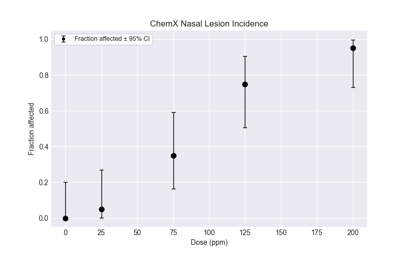
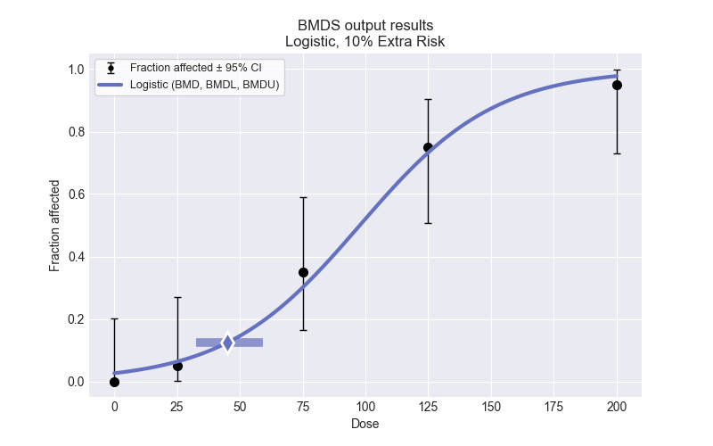
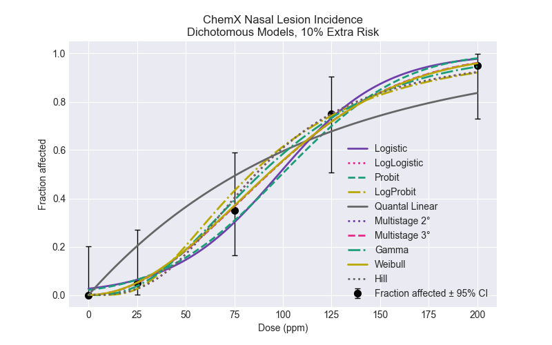

# Run a Dichotomous Dataset

## Quickstart

To run a dichotomous dataset:

```python
import bmds
from bmds import DichotomousDataset
from bmds.bmds3.types.dichotomous import DichotomousRiskType

dataset = DichotomousDataset(
    doses=[0, 25, 75, 125, 200],
    ns=[20, 20, 20, 20, 20],
    incidences=[0, 1, 7, 15, 19],
)

# create a BMD session
session = bmds.BMDS.latest_version(dataset=dataset)

# add all default models
session.add_default_models()

# execute the session
session.execute()

# recommend a best-fitting model
session.recommend()

model_index = session.recommender.results.recommended_model_index
if model_index:
    model = session.models[model_index]
    print(model.text())

# save excel report
df = session.to_df()
df.to_excel("report.xlsx")

# save to a word report
report = session.to_docx()
report.save("report.docx")
```

## Create a dichotomous dataset

To create a dichotomous dataset, you need a list of doses, incidences, and the total number of subjects. As shown above, you use the ```DichotomousDataset()``` function and insert your data. You can also create a plot of the dataset:

```python
import bmds
from bmds import DichotomousDataset
from bmds.bmds3.models import dichotomous
from bmds.bmds3.types.dichotomous import DichotomousRiskType

dataset = DichotomousDataset(
    doses=[0, 25, 75, 125, 200],
    ns=[20, 20, 20, 20, 20],
    incidences=[0, 1, 7, 15, 19],
)

dplot = dataset.plot()
dplot.savefig("dataset-plot.png")
```

The saved plot will look like this:


## Fitting one model to dataset

If you want to fit only one model to your dataset, you can fit the specific model to the dataset and print the results such as the BMD, BMDL, BMDU, p-value, AIC, etc. Say you want to fit the Logistic model, you can run the code below and print the results:

```python
model = dichotomous.Logistic(dataset)
model.execute()
text = model.text()
print(text)
```

Which will show:
```python
      Logistic      
════════════════════

Input Summary:
╒═══════════════════╤══════════════════════════╕
│ BMR               │ 10% Extra Risk           │
│ Confidence Level  │ 0.95                     │
│ Modeling approach │ Frequentist unrestricted │
╘═══════════════════╧══════════════════════════╛

Parameter Settings:
╒═════════════╤═══════════╤═══════╤═══════╕
│ Parameter   │   Initial │   Min │   Max │
╞═════════════╪═══════════╪═══════╪═══════╡
│ a           │         0 │   -18 │    18 │
│ b           │         0 │     0 │   100 │
╘═════════════╧═══════════╧═══════╧═══════╛

Summary:
╒════════════════╤═══════════╕
│ BMD            │ 44.8841   │
│ BMDL           │ 32.5885   │
│ BMDU           │ 59.2      │
│ AIC            │ 70.1755   │
│ Log Likelihood │ 33.0878   │
│ P-Value        │  0.666151 │
│ Overall DOF    │  3        │
│ Chi²           │  1.57027  │
╘════════════════╧═══════════╛

Model Parameters:
╒════════════╤════════════╤═══════════╤═════════════╤════════════╤════════════╕
│ Variable   │   Estimate │ Bounded   │   Std Error │   Lower CI │   Upper CI │
╞════════════╪════════════╪═══════════╪═════════════╪════════════╪════════════╡
│ a          │ -3.62365   │ no        │  0.707212   │  -5.00976  │ -2.23754   │
│ b          │  0.0370501 │ no        │  0.00705474 │   0.023223 │  0.0508771 │
╘════════════╧════════════╧═══════════╧═════════════╧════════════╧════════════╛

Goodness of Fit:
╒════════╤════════╤════════════╤════════════╤════════════╤═══════════════════╕
│   Dose │   Size │   Observed │   Expected │   Est Prob │   Scaled Residual │
╞════════╪════════╪════════════╪════════════╪════════════╪═══════════════════╡
│      0 │     20 │          0 │    0.51983 │  0.0259915 │         -0.730549 │
│     25 │     20 │          1 │    1.26254 │  0.063127  │         -0.241397 │
│     75 │     20 │          7 │    6.01009 │  0.300505  │          0.482793 │
│    125 │     20 │         15 │   14.651   │  0.732552  │          0.176289 │
│    200 │     20 │         19 │   19.5565  │  0.977825  │         -0.845059 │
╘════════╧════════╧════════════╧════════════╧════════════╧═══════════════════╛

Analysis of Deviance:
╒═══════════════╤══════════════════╤════════════╤════════════╤════════════╤═════════════╕
│ Model         │   Log Likelihood │   # Params │ Deviance   │ Test DOF   │ P-Value     │
╞═══════════════╪══════════════════╪════════════╪════════════╪════════════╪═════════════╡
│ Full model    │         -32.1362 │          5 │ -          │ -          │ -           │
│ Fitted model  │         -33.0878 │          2 │ 1.90305    │ 3          │ 0.592771    │
│ Reduced model │         -68.0292 │          1 │ 71.7859    │ 4          │ 9.54792e-15 │
╘═══════════════╧══════════════════╧════════════╧════════════╧════════════╧═════════════╛
```

You can also plot the model fit by:

```python
mplot = model.plot()
mplot.savefig("logistic-plot.png")
```

And you will have a saved plot in your directory that looks like:


The individual models that you can fit are shown below. Note that the degrees of the Multistage model can be increased to a maximum of the lesser of n-1 or 8 (as specified in the BMDS User Guide).

```python
dichotomous.QuantalLinear(dataset)
dichotomous.Multistage(dataset, settings = {"degree": 2})
dichotomous.Multistage(dataset, settings = {"degree": 3}) ## you can increase the degrees up to a maximum of the lesser of n-1 or 8
dichotomous.Logistic(dataset)
dichotomous.LogLogistic(dataset)
dichotomous.Probit(dataset)
dichotomous.LogProbit(dataset)
dichotomous.Gamma(dataset)
dichotomous.Weibull(dataset)
dichotomous.Hill(dataset)
```

## Run all models and select the best fit

As shown in the Quickstart above, you can run all of the default dichotomous models and select the recommended model. To run all the default models, save the results, and save the plot of the fit of the recommended model with the data:

```python
import bmds
from bmds import DichotomousDataset
from bmds.bmds3.types.dichotomous import DichotomousRiskType

dataset = DichotomousDataset(
    doses=[0, 25, 75, 125, 200],
    ns=[20, 20, 20, 20, 20],
    incidences=[0, 1, 7, 15, 19],
)

# create a BMD session
session = bmds.BMDS.latest_version(dataset=dataset)

# add all default models
session.add_default_models()

# execute the session
session.execute()

# recommend a best-fitting model
session.recommend()

#print recommended model and plot recommended model with dataset
model_index = session.recommender.results.recommended_model_index
if model_index:
    model = session.models[model_index]
    print(model.text())
    mplot = model.plot()
    mplot.savefig("recommended-model-plot.png")

# save excel report
df = session.to_df()
df.to_excel("report.xlsx")

# save to a word report
report = session.to_docx()
report.save("report.docx")
``` 

The reports and the plot will be saved in your directory. 

## Changing the input settings

The default settings for a dichotomous run use a BMR of 10% Extra Risk and a 95% confidence interval. If you fit just one model to your dataset, you can change these settings by:

```python
model = dichotomous.Logistic(dataset, settings = {"bmr": 0.15, "bmr_type": DichotomousRiskType.AddedRisk, "alpha": 0.1})
```

If you run all the default models and select the best fit, you can change these settings by:

```python
session.add_default_models(global_settings = {"bmr": 0.15, "bmr_type": DichotomousRiskType.AddedRisk, "alpha": 0.1})
```

This would run the dichotomous models for a BMR of 15% Added Risk at a 90% confidence interval.

## How to plot all dichotomous models on one plot

If you want to plot all the default dichotomous models that were fit to your dataset to compare models, you can use the code below and a figure will be saved in your directory. 

```python
# plotting all models on one plot
def plot(colorize: bool = False):
   
    dataset = session.dataset
    results = session.execute()
    fig = dataset.plot()
    ax = fig.gca()
    ax.set_ylim(-0.05, 1.05)
    title = f"{dataset._get_dataset_name()}\nDichotomous Models, 10% Extra Risk" ## change title if you used a different BMR to calculate BMD
    ax.set_title(title)
    if colorize:
        color_cycle = cycle(plotting.INDIVIDUAL_MODEL_COLORS)
        line_cycle = cycle(plotting.INDIVIDUAL_LINE_STYLES)
    else:
        color_cycle = cycle(["#ababab"])
        line_cycle = cycle(["solid"])
    for i, model in enumerate(session.models):
        if colorize:
            label = model.name()
            print(label)
        elif i == 0:
            label = "Individual models"
        else:
            label = None
        ax.plot(
            model.results.plotting.dr_x,
            model.results.plotting.dr_y,
            label=label,
            c=next(color_cycle),
            linestyle=next(line_cycle),
            zorder=100,
            lw=2,
        )


    # reorder handles and labels
    handles, labels = ax.get_legend_handles_labels()
    order = [2, 0, 1]
    ax.legend(
    )

    return fig


plot = plot(True)
plot.savefig("dichotomous-dataset.png")
```

And the plot would be saved as:
