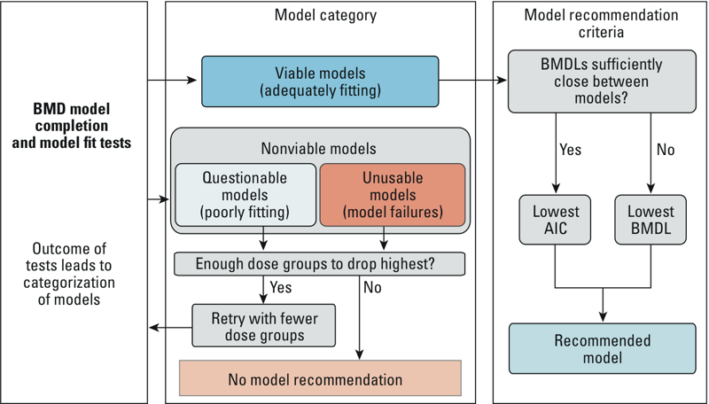

# Recommendation logic

A BMDS session in this software package has a set of automated rules for recommending a best-fitting model from runs included in the session. The rules are a combination of heuristic and statistical rules, and were generated from two sources:

1. USEPA BMDS technical guidance ([EPA 2012](https://www.epa.gov/risk/benchmark-dose-technical-guidance))
2. [Wignall et al. 2014](http://dx.doi.org/10.1289/ehp.1307539)

When configuration a session, a user selects which models and models recommendation is enabled. If enabled, recommendation logic has reasonable defaults, but it can also be manually configured to turn on/off individual checks and threshold values. Results are extracted from model outputs, and models are placed into one of three possible bins, depending on the results and the bin recommendation logic:

1. **Failure**: model did not successfully complete
2. **Nonviable model**: model successfully completed, but there are serious issues
3. **Viable model**: candidate for recommended model, but there may be warnings

If at least one viable model exists, then it may be selected as a best fitting model. This would be consistent with what was done in the workflow diagram below:

{: style="max-height:350px"}

**Model binning and recommendation. From [Wignall et al. 2014](http://dx.doi.org/10.1289/ehp.1307539).**

If one and only one model is in the viable model bin, it is selected as the best fitting model. If there are more than one model in the viable bin, then, consistent with [EPA 2012](https://www.epa.gov/risk/benchmark-dose-technical-guidance), either the model with the lowest Akaike information criterion (AIC) or benchmark dose lower confidence limit (BMDL) is selected. If the range of BMDL values is sufficiently close (<3 fold different), the AIC value is used, otherwise, the BMDL value is used.

It is possible that some models may collapse into other models. For example, if a power-model doesn't use the power-term after parameter optimization, then it may be equivalent to a linear model. Or, a 3rd order polynomial may only use it's first two polynomials, and therefore would be equivalent to a 2nd order polynomial. In these two examples, equivalent models will have identical AIC and BMDL values. This package is aware of this and will pick the model which had the fewest number of parameters available for curve-fitting *a priori* to parameter optimization, and therefore the linear and polynomial 2 model will be selected as opposed to the power or polynomial 3 models in the examples above, respectively.

!!! note - "Automated dose dropping"

    In older versions of python BMDS (for example, [v0.11.0](https://pypi.org/project/bmds/0.11.0/#history)), sessions could be configured to automatically drop the highest dose group recursively until a model was recommended or no further doses could be dropped. This was consistent with the [Wignall et al. 2014](http://dx.doi.org/10.1289/ehp.1307539) workflow described above. This feature was removed from recent versions of the package. If you'd like to programmatically drop doses during a session, feel free to contact us and we can help write a script to do so.
