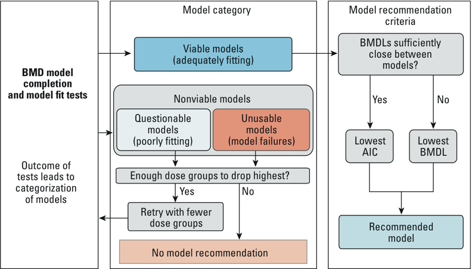

Recommendation logic
====================

A BMDS session in the python BMDS software system has a set of automated rules
for recommending a best-fitting model from a suite of models run in BMDS. The
rules are a combination of heuristic and statistical rules, and have been
generated from primarily three different sources:

1. US EPA BMDS technical guidance (`EPA 2012`_)
2. `ICF BMDS Wizard`_
3. `Wignall et al. 2014`_

.. _`EPA 2012`: https://www.epa.gov/risk/benchmark-dose-technical-guidance
.. _`ICF BMDS Wizard`: https://www.icf.com/solutions-and-apps/bmds-wizard
.. _`Wignall et al. 2014`: http://dx.doi.org/10.1289/ehp.1307539

A user selects which models to run and then all models are executed.
Recommendation logic can be modified or defaults (described below) can be
used. Results are extracted from model output files, and models are placed
into one of three possible bins, depending on the results and the bin
recommendation logic:

1. **Failure**: model did not successfully complete
2. **Nonviable model**: model successfully completed, but there are serious issues
3. **Viable model**: candidate for recommended model, but there may be warnings

If at least one viable model exists, then it may be selected as a best fitting
model. Alternatively, a user may choose to drop the highest dose and attempt
to re-run available models. This would be consistent with what was done in the
workflow diagram below:

    Model binning and recommendation. From `Wignall et al. 2014`_.

If one and only one model is in the viable model bin, it is selected as the best
fitting model. If there are more than one model in the viable bin, then,
consistent with `EPA 2012`_, either the model with the lowest Akaike information
criterion (AIC) or benchmark dose lower confidence limit (BMDL) is selected. If
the range of BMDL values is sufficiently close (<3 fold different), the AIC value
is used, otherwise, the BMDL value is used.

It is possible that some models may collapse into other models. For
example, if a power-model doesn't use the power-term after parameter optimization,
then it may be equivalent to a linear model. Or, a 3rd order polynomial may only
use it's first two polynomials, and therefore would be equivalent to a 2nd order
polynomial. In these two examples, equivalent models will have identical AIC and
BMDL values. The python bmds library is aware of this and will pick the
model which had the fewest number of parameters available for curve-fitting *a priori*
to parameter optimization, and therefore the linear and polynomial 2 model will
be selected as opposed to the power or polynomial 3 models in the examples above.

Bin recommendation logic
------------------------

Bin recommendation logic can be modified, but reasonable defaults are assumed.
Default are dataset-type specific. For viable models, if a test is true, it
still may be recommended as a best fitting model, but a warning will be presented
and its use for model selection should be evaluated manually to ensure it
meets the needs of risk assessors. Default rules are shown below:

Continuous datasets
~~~~~~~~~~~~~~~~~~~

+--------------------------------+-------------------------------------------------------------------------------------------------------------+-------------------------+--------------------------------+
| Rule                           | Description of Success                                                                                      | Numerical Threshold (N) | Bin Placement for Rule Failure |
+================================+=============================================================================================================+=========================+================================+
| BMD existence                  | A BMD exists.                                                                                               | N/A                     | Failure                        |
+--------------------------------+-------------------------------------------------------------------------------------------------------------+-------------------------+--------------------------------+
| BMDL existence                 | A BMDL exists.                                                                                              | N/A                     | Failure                        |
+--------------------------------+-------------------------------------------------------------------------------------------------------------+-------------------------+--------------------------------+
| AIC existence                  | An AIC exists.                                                                                              | N/A                     | Failure                        |
+--------------------------------+-------------------------------------------------------------------------------------------------------------+-------------------------+--------------------------------+
| Residual of interest existence | The residual at the dose-group closest to the BMD (i.e., the residual of interest) exists.                  | N/A                     | Nonviable                      |
+--------------------------------+-------------------------------------------------------------------------------------------------------------+-------------------------+--------------------------------+
| Variance model selection       | The variance model used is appropriate (p-value 3 > N).                                                     | 0.1                     | Nonviable                      |
+--------------------------------+-------------------------------------------------------------------------------------------------------------+-------------------------+--------------------------------+
| Variance model fit             | The variance model fits the data sufficiently well (p-value 2 > N).                                         | 0.1                     | Nonviable                      |
+--------------------------------+-------------------------------------------------------------------------------------------------------------+-------------------------+--------------------------------+
| Global goodness of fit (GGOF)  | The mean-model fits the data sufficiently well (p-value 4 > N).                                             | 0.1                     | Nonviable                      |
+--------------------------------+-------------------------------------------------------------------------------------------------------------+-------------------------+--------------------------------+
| BMD to BMDL ratio              | The ratio of BMD to BMDL is not large (BMD/BMDL < N).                                                       | 20                      | Nonviable                      |
+--------------------------------+-------------------------------------------------------------------------------------------------------------+-------------------------+--------------------------------+
| High BMDL                      | The BMDL is < N times higher than the maximum dose.                                                         | 1                       | Nonviable                      |
+--------------------------------+-------------------------------------------------------------------------------------------------------------+-------------------------+--------------------------------+
| Low BMD                        | The BMD is < N times lower than the minimum nonzero dose.                                                   | 10                      | Nonviable                      |
+--------------------------------+-------------------------------------------------------------------------------------------------------------+-------------------------+--------------------------------+
| Low BMDL                       | The BMDL is < N times lower than the minimum nonzero dose.                                                  | 10                      | Nonviable                      |
+--------------------------------+-------------------------------------------------------------------------------------------------------------+-------------------------+--------------------------------+
| Control residual               | The residual at control is small (residual < N).                                                            | 2                       | Nonviable                      |
+--------------------------------+-------------------------------------------------------------------------------------------------------------+-------------------------+--------------------------------+
| Control standard deviation     | The modeled standard deviation is similar to the actual (< N times different).                              | 1.5                     | Nonviable                      |
+--------------------------------+-------------------------------------------------------------------------------------------------------------+-------------------------+--------------------------------+
| BMD to BMDL ratio (warning)    | The ratio of BMD to BMDL is not large (BMD/BMDL < N).                                                       | 5                       | Viable                         |
+--------------------------------+-------------------------------------------------------------------------------------------------------------+-------------------------+--------------------------------+
| Residual of interest           | The residual at the dose-group closest to the BMD (i.e., the residual of interest) is small (residual < N). | 2                       | Viable                         |
+--------------------------------+-------------------------------------------------------------------------------------------------------------+-------------------------+--------------------------------+
| No warnings are reported       | No warnings in the BMD model system were reported.                                                          | N/A                     | Viable                         |
+--------------------------------+-------------------------------------------------------------------------------------------------------------+-------------------------+--------------------------------+
| High BMD                       | The BMD is < N times higher than the maximum dose.                                                          | 1                       | Viable                         |
+--------------------------------+-------------------------------------------------------------------------------------------------------------+-------------------------+--------------------------------+
| Low BMD (warning)              | The BMD is < N times lower than the minimum nonzero dose.                                                   | 3                       | Viable                         |
+--------------------------------+-------------------------------------------------------------------------------------------------------------+-------------------------+--------------------------------+
| Low BMDL (warning)             | The BMDL is < N times lower than the minimum nonzero dose.                                                  | 3                       | Viable                         |
+--------------------------------+-------------------------------------------------------------------------------------------------------------+-------------------------+--------------------------------+

Dichotomous datasets
~~~~~~~~~~~~~~~~~~~~

+--------------------------------+-------------------------------------------------------------------------------------------------------------+-------------------------+--------------------------------+
| Rule                           | Description of Success                                                                                      | Numerical Threshold (N) | Bin Placement for Rule Failure |
+================================+=============================================================================================================+=========================+================================+
| BMD existence                  | A BMD exists.                                                                                               | N/A                     | Failure                        |
+--------------------------------+-------------------------------------------------------------------------------------------------------------+-------------------------+--------------------------------+
| BMDL existence                 | A BMDL exists.                                                                                              | N/A                     | Failure                        |
+--------------------------------+-------------------------------------------------------------------------------------------------------------+-------------------------+--------------------------------+
| AIC existence                  | An AIC exists.                                                                                              | N/A                     | Failure                        |
+--------------------------------+-------------------------------------------------------------------------------------------------------------+-------------------------+--------------------------------+
| Residual of interest existence | The residual at the dose-group closest to the BMD (i.e., the residual of interest) exists.                  | N/A                     | Nonviable                      |
+--------------------------------+-------------------------------------------------------------------------------------------------------------+-------------------------+--------------------------------+
| Global goodness of fit (GGOF)  | The mean-model fits the data sufficiently well (p-value 4 > N).                                             | 0.1                     | Nonviable                      |
+--------------------------------+-------------------------------------------------------------------------------------------------------------+-------------------------+--------------------------------+
| BMD to BMDL ratio              | The ratio of BMD to BMDL is not large (BMD/BMDL < N).                                                       | 20                      | Nonviable                      |
+--------------------------------+-------------------------------------------------------------------------------------------------------------+-------------------------+--------------------------------+
| High BMDL                      | The BMDL is < N times higher than the maximum dose.                                                         | 1                       | Nonviable                      |
+--------------------------------+-------------------------------------------------------------------------------------------------------------+-------------------------+--------------------------------+
| Low BMD                        | The BMD is < N times lower than the minimum nonzero dose.                                                   | 10                      | Nonviable                      |
+--------------------------------+-------------------------------------------------------------------------------------------------------------+-------------------------+--------------------------------+
| Low BMDL                       | The BMDL is < N times lower than the minimum nonzero dose.                                                  | 10                      | Nonviable                      |
+--------------------------------+-------------------------------------------------------------------------------------------------------------+-------------------------+--------------------------------+
| BMD to BMDL ratio (warning)    | The ratio of BMD to BMDL is not large (BMD/BMDL < N).                                                       | 5                       | Viable                         |
+--------------------------------+-------------------------------------------------------------------------------------------------------------+-------------------------+--------------------------------+
| Residual of interest           | The residual at the dose-group closest to the BMD (i.e., the residual of interest) is small (residual < N). | 2                       | Viable                         |
+--------------------------------+-------------------------------------------------------------------------------------------------------------+-------------------------+--------------------------------+
| No warnings are reported       | No warnings in the BMD model system were reported.                                                          | N/A                     | Viable                         |
+--------------------------------+-------------------------------------------------------------------------------------------------------------+-------------------------+--------------------------------+
| High BMD                       | The BMD is < N times higher than the maximum dose.                                                          | 1                       | Viable                         |
+--------------------------------+-------------------------------------------------------------------------------------------------------------+-------------------------+--------------------------------+
| Low BMD (warning)              | The BMD is < N times lower than the minimum nonzero dose.                                                   | 3                       | Viable                         |
+--------------------------------+-------------------------------------------------------------------------------------------------------------+-------------------------+--------------------------------+
| Low BMDL (warning)             | The BMDL is < N times lower than the minimum nonzero dose.                                                  | 3                       | Viable                         |
+--------------------------------+-------------------------------------------------------------------------------------------------------------+-------------------------+--------------------------------+

Dichotomous cancer datasets
~~~~~~~~~~~~~~~~~~~~~~~~~~~

+--------------------------------+-------------------------------------------------------------------------------------------------------------+-------------------------+--------------------------------+
| Rule                           | Description of Success                                                                                      | Numerical Threshold (N) | Bin Placement for Rule Failure |
+================================+=============================================================================================================+=========================+================================+
| BMD existence                  | A BMD exists.                                                                                               | N/A                     | Failure                        |
+--------------------------------+-------------------------------------------------------------------------------------------------------------+-------------------------+--------------------------------+
| BMDL existence                 | A BMDL exists.                                                                                              | N/A                     | Failure                        |
+--------------------------------+-------------------------------------------------------------------------------------------------------------+-------------------------+--------------------------------+
| AIC existence                  | An AIC exists.                                                                                              | N/A                     | Failure                        |
+--------------------------------+-------------------------------------------------------------------------------------------------------------+-------------------------+--------------------------------+
| Residual of interest existence | The residual at the dose-group closest to the BMD (i.e., the residual of interest) exists.                  | N/A                     | Nonviable                      |
+--------------------------------+-------------------------------------------------------------------------------------------------------------+-------------------------+--------------------------------+
| Global goodness of fit (GGOF)  | The mean-model fits the data sufficiently well (p-value 4 > N).                                             | 0.05                    | Nonviable                      |
+--------------------------------+-------------------------------------------------------------------------------------------------------------+-------------------------+--------------------------------+
| BMD to BMDL ratio              | The ratio of BMD to BMDL is not large (BMD/BMDL < N).                                                       | 20                      | Nonviable                      |
+--------------------------------+-------------------------------------------------------------------------------------------------------------+-------------------------+--------------------------------+
| High BMDL                      | The BMDL is < N times higher than the maximum dose.                                                         | 1                       | Nonviable                      |
+--------------------------------+-------------------------------------------------------------------------------------------------------------+-------------------------+--------------------------------+
| Low BMD                        | The BMD is < N times lower than the minimum nonzero dose.                                                   | 10                      | Nonviable                      |
+--------------------------------+-------------------------------------------------------------------------------------------------------------+-------------------------+--------------------------------+
| Low BMDL                       | The BMDL is < N times lower than the minimum nonzero dose.                                                  | 10                      | Nonviable                      |
+--------------------------------+-------------------------------------------------------------------------------------------------------------+-------------------------+--------------------------------+
| BMD to BMDL ratio (warning)    | The ratio of BMD to BMDL is not large (BMD/BMDL < N).                                                       | 5                       | Viable                         |
+--------------------------------+-------------------------------------------------------------------------------------------------------------+-------------------------+--------------------------------+
| Residual of interest           | The residual at the dose-group closest to the BMD (i.e., the residual of interest) is small (residual < N). | 2                       | Viable                         |
+--------------------------------+-------------------------------------------------------------------------------------------------------------+-------------------------+--------------------------------+
| No warnings are reported       | No warnings in the BMD model system were reported.                                                          | N/A                     | Viable                         |
+--------------------------------+-------------------------------------------------------------------------------------------------------------+-------------------------+--------------------------------+
| High BMD                       | The BMD is < N times higher than the maximum dose.                                                          | 1                       | Viable                         |
+--------------------------------+-------------------------------------------------------------------------------------------------------------+-------------------------+--------------------------------+
| Low BMD (warning)              | The BMD is < N times lower than the minimum nonzero dose.                                                   | 3                       | Viable                         |
+--------------------------------+-------------------------------------------------------------------------------------------------------------+-------------------------+--------------------------------+
| Low BMDL (warning)             | The BMDL is < N times lower than the minimum nonzero dose.                                                  | 3                       | Viable                         |
+--------------------------------+-------------------------------------------------------------------------------------------------------------+-------------------------+--------------------------------+
